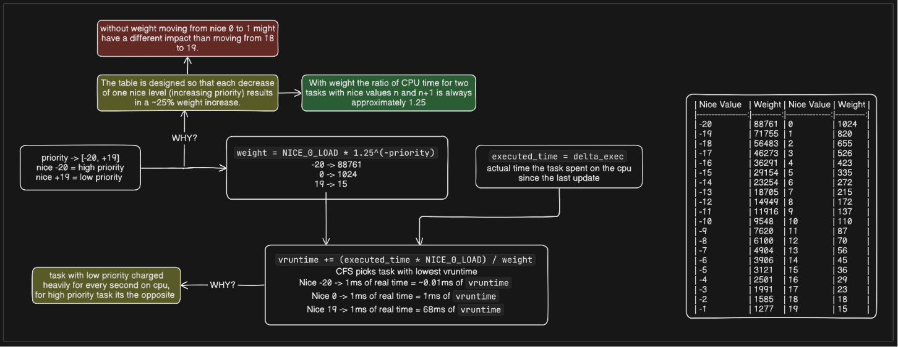

# task-scheduler-implementation-cpp

A C++ implementation of the **Linux Completely Fair Scheduler (CFS)** algorithm, now with an **interactive web visualizer** you can run entirely in the browser.

---

## Web Visualizer

The `web/` directory contains a full Next.js + TypeScript app that reimplements the CFS algorithm in the browser and lets you step through the simulation visually.

**Features:**
- Load the original sample data or generate random workloads with one click
- Step-by-step playback with Play / Pause / Step / Speed controls
- Gantt chart showing each scheduling event per process
- Live vruntime bar chart updated at each step
- Priority queue state visualization
- Per-process statistics: turnaround time, waiting time, CPU time

**Run locally:**
```sh
cd web
npm install
npm run dev
# Open http://localhost:3000
```

**Live demo:** https://task-scheduler-implementation-cpp.vercel.app/

---

## Algorithm Explained

CFS selects the process with the lowest `vruntime` (virtual runtime) at each scheduling decision. High-priority processes accumulate vruntime slowly; low-priority ones accumulate it fast, so they get scheduled less frequently.

**Weight formula:**
```
weight = NICE_0_LOAD * 1.25^(-priority)
```

**vruntime update:**
```
vruntime += (executed_time * NICE_0_LOAD) / weight
```

The data structure is a **min-heap ordered by vruntime**, giving O(log n) insertion and O(1) lookup of the next process.



---


## **1st Approach: Using Docker (Recommended)**

Docker provides a simple and reproducible environment for building and running the scheduler.

### **Prerequisites**
- Install [Docker](https://docs.docker.com/get-docker/)
- Install [Docker Compose](https://docs.docker.com/compose/install/)

### **Steps to Build and Run**

1. Clone the repository:
   ```sh
   git clone https://github.com/YOUR_USERNAME/task-scheduler-cpp.git
   cd task-scheduler-cpp
   ```

2. Build and run the project using Docker Compose:
   ```sh
   docker-compose up --build
   ```

3. Once execution completes, the output files will be available in the `output` folder on your host machine:
   - `output/process_schedule.csv`
   - `output/cfs_advanced_visualization.png`

4. If you need to retrieve the plot manually, use:
   ```sh
   docker cp <container_id>:/app/output/cfs_advanced_visualization.png .
   ```

---

## **2nd Approach: Manual Setup on Windows**

If you prefer to build the project manually on Windows, follow these steps.

### **1. Install MSYS2 and MinGW-w64**

1. Download MSYS2 from [MSYS2 website](https://www.msys2.org/).
2. Install it and open **MSYS2 MinGW 64-bit** terminal (**not MSYS or UCRT**).
3. Update package manager:
   ```sh
   pacman -Syu
   ```
4. Close the terminal and reopen it, then install required packages:
   ```sh
   pacman -S --needed base-devel mingw-w64-x86_64-toolchain mingw-w64-x86_64-cmake mingw-w64-x86_64-make
   ```

### **2. Add MinGW to System PATH**

1. Press **Win + R**, type `sysdm.cpl`, and press **Enter**.
2. Go to **Advanced** → Click **Environment Variables**.
3. Under **System Variables**, edit the `Path` variable and add:
   ```
   C:\msys64\mingw64\bin
   ```
4. Click **OK**, then restart **PowerShell** or **Command Prompt**.

To verify:
```sh
mingw32-make --version
```

### **3. Clone the Repository**

```sh
git clone https://github.com/YOUR_USERNAME/task-scheduler-cpp.git
cd task-scheduler-cpp
```

### **4. Build the Project**

```sh
mkdir build && cd build
cmake .. -G "MinGW Makefiles"
mingw32-make
```

### **5. Run the Program**

```sh
./cfs_scheduler
```

### **6. Generate Visualization**

1. Create and activate a Python virtual environment:
   ```sh
   python -m venv .venv
   source .venv/bin/activate  # On Windows, use .venv\Scripts\activate
   ```
2. Install dependencies:
   ```sh
   pip install -r requirements.txt
   ```
3. Run the plotting script:
   ```sh
   python plot.py
   ```

---

## **Troubleshooting**

**Issue:** `make: command not found`
**Solution:** Install `mingw-w64-x86_64-make`:
```sh
pacman -S --needed mingw-w64-x86_64-make
```

**Issue:** `cmake: No usable generator found`
**Solution:** Run CMake with the correct generator:
```sh
cmake .. -G "MinGW Makefiles"
```

**Issue:** `mingw32-make is not recognized`
**Solution:** Ensure MinGW is in your PATH (**Step 2** above).

---

## **Contact**

For any issues, feel free to open an issue on GitHub or reach out.
